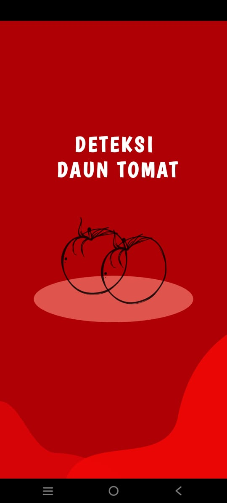
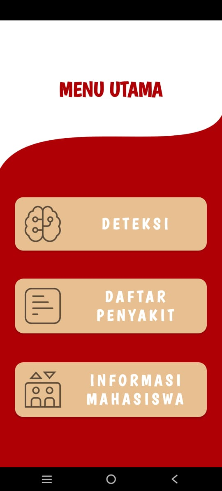

### Hey Guys 
# Tugas UAS Sistem Cerdas

Tugas uas sistem cerdas dengan judul "Sistem Pakar diagnosa penyakit pada tanaman tomat menggunakan CNN berbasis android"
menggunakan algoritma CNN

## Our Team 🌱

Moh Saddam Satria Pattanang (202155202049)

Bakti Prasetyo (202155202066)

Devi Maharani (202155202068)

Muhammad Shaleh Syakil Syam (202155202099)

Adjid Ardiansyah Hamdar (202155202028)

Maya Nurlati Kelian (202155202077)

Onalisa Mayor (202155202012)

## Tampilan Aplikasi 💻

  
Halaman Splashh Screen

  <figure style="margin-bottom: 20px; text-align: center;">
    
  </figure>

  
Halaman Utama Aplikasi

  <figure style="margin-bottom: 20px; text-align: center;">
    
  </figure>

